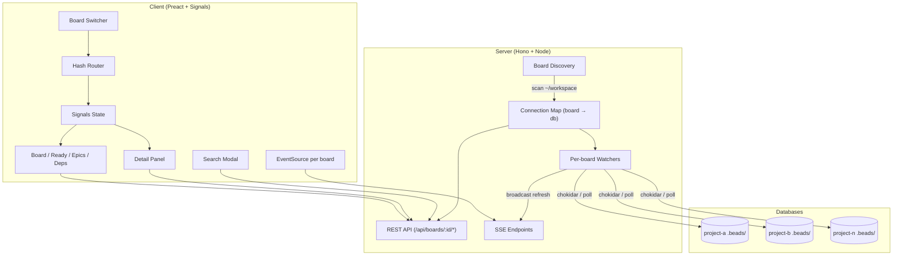

# bd-eye

A read-only visual dashboard for [Beads](https://github.com/steveyegge/beads) issue databases. It auto-discovers all Beads projects under a configurable root directory and lets you switch between them from a single running instance. It supports both SQLite and [Dolt](https://www.dolthub.com/) backends, watching for changes and pushing live updates to all connected browsers via Server-Sent Events.

## Features

- **Multi-board support**: auto-discovers Beads projects and provides a dropdown to switch between them
- Kanban board with issues grouped by status
- Ready queue showing unblocked issues available for work
- Epic explorer with child-issue progress bars
- Dependency graph displaying blocking relationships
- Full-text search across titles, descriptions, and notes
- Live updates: the UI refreshes automatically when the database changes
- Filtering by priority, type, assignee, and label
- Deep-linkable views and issue selection via hash routing (`#/:board/:view`)

## Prerequisites

- Node.js >= 18
- A Beads database — either a SQLite file (`.beads/*.db`) or a running Dolt SQL server

## Quick Start

```sh
npm install
npm run build
npm start
```

During development, run the Vite dev server and the API server together:

```sh
npm run dev
```

This starts the API server on port 3333 and the Vite dev server on port 5174 with API requests proxied automatically.

## Configuration

bd-eye is configured via `~/.bd-eye.json`. A default config is created automatically on first run:

```json
{
  "scanRoots": ["~/workspace"],
  "lastUsedBoard": "my-project",
  "excludePaths": []
}
```

| Key              | Description                                                  | Default          |
|------------------|--------------------------------------------------------------|------------------|
| `scanRoots`      | Directories to scan for Beads projects (each top-level child with a `.beads/*.db` is a board) | `["~/workspace"]` |
| `lastUsedBoard`  | Board to open when no board is specified in the URL          | First alphabetically |
| `excludePaths`   | Absolute paths to skip during scanning                       | `[]`             |

### Board discovery

At startup, bd-eye scans each directory in `scanRoots` one level deep, looking for child directories that contain `.beads/*.db`. Each match becomes a board, identified by its directory name. Symlinks are not followed. The server opens a read-only connection to every discovered board and maintains a per-board file watcher and SSE stream — switching boards in the UI is instant with no reconnection lag.

If no boards are found, the UI displays a helpful message prompting you to run `bd init` in a project.

## Environment Variables

| Variable        | Description                                      | Default                                            |
|-----------------|--------------------------------------------------|----------------------------------------------------|
| `PORT`          | HTTP port for the production server              | `3333`                                             |
| `DOLT_HOST`     | Dolt SQL server hostname                         | `127.0.0.1`                                        |
| `DOLT_PORT`     | Dolt SQL server port                             | `3306`                                             |
| `DOLT_USER`     | Dolt SQL server username                         | `root`                                             |
| `DOLT_PASSWORD`  | Dolt SQL server password                         | *(empty)*                                          |
| `DOLT_DATABASE` | Dolt database name                               | Auto-discovered if the server has exactly one user database |

### Dolt setup

For boards backed by Dolt instead of SQLite, start a Dolt SQL server and set the corresponding environment variables:

```sh
dolt sql-server --host 127.0.0.1 --port 3307 --data-dir .beads/dolt
```

```sh
DOLT_PORT=3307 npm start
```

If the server hosts exactly one user database, it is selected automatically. If there are multiple databases, set `DOLT_DATABASE` explicitly:

```sh
DOLT_PORT=3307 DOLT_DATABASE=beads_omnisearch npm start
```

Setting any `DOLT_*` variable activates Dolt mode for boards whose `.beads/` directory contains a `.dolt` subdirectory. Live updates work by polling `HASHOF('HEAD')` every 2 seconds — any Dolt commit triggers a refresh.

## Keyboard Shortcuts

| Key            | Action              |
|----------------|----------------------|
| `b`            | Switch to Board view |
| `r`            | Switch to Ready Queue |
| `e`            | Switch to Epics view |
| `d`            | Switch to Dependencies view |
| `Ctrl/Cmd + K` | Open search          |
| `Escape`       | Close detail panel   |

## URL Routing

Views are addressed as `#/:board/:view`, where `:board` is the project directory name and `:view` is one of `board`, `ready`, `epics`, or `deps`. Issue selection is appended as a query parameter:

```
http://localhost:3333/#/my-project/board?issue=proj-42
```

When you open bd-eye without a hash, it redirects to your last-used board. Switching boards via the nav dropdown resets filters and selection state.

## Architecture



At startup the server scans configured roots and opens a connection to every discovered Beads database (better-sqlite3 for SQLite, mysql2 for Dolt), storing them in a map keyed by board name. Each board gets its own file watcher (chokidar for SQLite, `HASHOF('HEAD')` polling for Dolt) and SSE stream. All API routes are scoped under `/api/boards/:boardId/`, so the client includes the current board name in every request.

The Preact client uses `@preact/signals` for reactive state, including a computed `apiBase` signal that updates when you switch boards. A hash-based router parses the board and view from the URL, and all data hooks re-fetch automatically when the board changes.

## License

MIT
