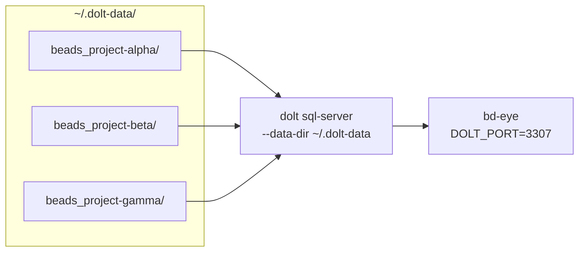
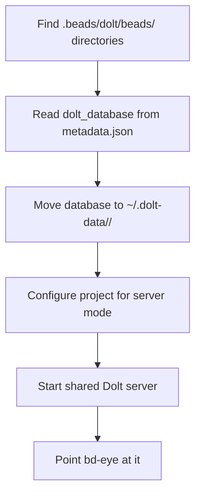
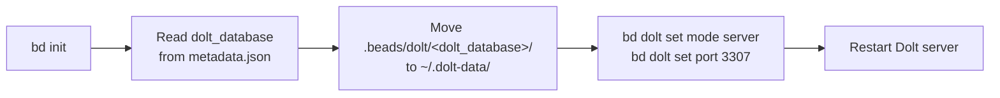
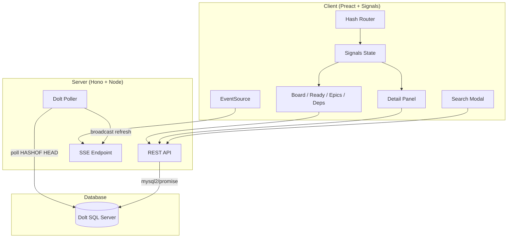

# bd-eye

A read-only visual dashboard for [Beads](https://github.com/steveyegge/beads) issue databases backed by [Dolt](https://www.dolthub.com/), watching for changes and pushing live updates to all connected browsers via Server-Sent Events.

## Features

- Kanban board with issues grouped by status
- Ready queue showing unblocked issues available for work
- Epic explorer with child-issue progress bars
- Dependency graph displaying blocking relationships
- Full-text search across titles, descriptions, and notes
- Live updates: the UI refreshes automatically when the database changes
- Filtering by priority, type, assignee, and label
- Deep-linkable views and issue selection via hash routing

## Prerequisites

- Node.js >= 18
- A running Dolt SQL server

## Quick Start

```sh
npm install
npm run build
npm start
```

During development, run the Vite dev server and the API server together:

```sh
npm run dev
```

This starts the API server on port 3333 and the Vite dev server on port 5174 with API requests proxied automatically.

## Environment Variables

| Variable        | Description                                      | Default                                            |
|-----------------|--------------------------------------------------|----------------------------------------------------|
| `PORT`          | HTTP port for the production server              | `3333`                                             |
| `DOLT_HOST`     | Dolt SQL server hostname                         | `127.0.0.1`                                        |
| `DOLT_PORT`     | Dolt SQL server port                             | `3306`                                             |
| `DOLT_USER`     | Dolt SQL server username                         | `root`                                             |
| `DOLT_PASSWORD`  | Dolt SQL server password                         | *(empty)*                                          |
| `DOLT_DATABASE` | Dolt database name                               | Auto-discovered if the server has exactly one user database |

### Dolt setup

Start a Dolt SQL server, then point bd-eye at it:

```sh
dolt sql-server --host 127.0.0.1 --port 3307 --data-dir .beads/dolt
```

```sh
DOLT_PORT=3307 npm start
```

If the server hosts exactly one user database, it is selected automatically. If there are multiple databases, set `DOLT_DATABASE` explicitly:

```sh
DOLT_PORT=3307 DOLT_DATABASE=beads_omnisearch npm start
```

Live updates work by polling `HASHOF('HEAD')` every 2 seconds — any Dolt commit triggers a refresh.

### Serving multiple projects from one Dolt server

A single Dolt server can serve multiple beads databases simultaneously. Dolt's `--data-dir` flag scans one level of subdirectories for `.dolt` directories — each becomes a separate database. This lets bd-eye switch between projects without restarting.



#### How it works

Each beads project stores its Dolt database at `.beads/dolt/beads/` and records a unique database name in `.beads/metadata.json` under the `dolt_database` key (e.g. `beads_my-project`). When moved to a central directory, the **directory name must match** this `dolt_database` value so that beads can find its database on the shared server.



#### Migrating with the script

A migration script is included that automates the entire process. It scans a directory tree for beads projects, moves their Dolt databases to a central location, and configures each project for server mode.

```sh
scripts/migrate-dolt-databases.sh ~/projects ~/.dolt-data
```

This will:
1. Find all dolt database directories under `~/projects/.beads/dolt/*/`
2. Read each project's `dolt_database` name from `.beads/metadata.json`
3. Move each database to `~/.dolt-data/<dolt_database>/`
4. Run `bd dolt set mode server` and `bd dolt set port 3307` in each project

Run with `--dry-run` first to preview what will happen:

```sh
scripts/migrate-dolt-databases.sh ~/projects ~/.dolt-data --dry-run
```

#### Migrating manually

If you prefer to do it by hand:

##### 1. Find your beads databases

```sh
find ~/projects -path '*/.beads/dolt/*/.dolt' -type d 2>/dev/null | sed 's|/.dolt$||' | grep -v '/.beads/dolt$'
```

##### 2. Check each project's database name

```sh
cat ~/projects/my-project/.beads/metadata.json | grep dolt_database
```

This gives you the name to use for the directory, e.g. `beads_my-project`.

##### 3. Create a central dolt data directory

```sh
mkdir -p ~/.dolt-data
```

##### 4. Move each database

The directory name under `~/.dolt-data/` **must match** the `dolt_database` value from metadata.json.

```sh
mv ~/projects/my-project/.beads/dolt/beads_my-project ~/.dolt-data/beads_my-project
```

##### 5. Switch each project to server mode

```sh
cd ~/projects/my-project
bd dolt set mode server
bd dolt set port 3307
```

#### Starting the shared server

```sh
dolt sql-server --host 127.0.0.1 --port 3307 --data-dir ~/.dolt-data
```

Verify the databases are visible:

```sh
dolt --host 127.0.0.1 --port 3307 --no-tls --user root --password "" sql -q "SHOW DATABASES"
```

#### Point bd-eye at the shared server

```sh
DOLT_PORT=3307 npm start
```

bd-eye discovers all valid beads databases automatically via `SHOW DATABASES`.

#### Adding a new project later



```sh
cd ~/projects/new-project
bd init
```

Beads creates `.beads/dolt/<dolt_database>/` where `<dolt_database>` is the unique database name from `.beads/metadata.json` (e.g. `beads_new-project`). Check the name:

```sh
grep dolt_database .beads/metadata.json
```

Move the database to the central directory, matching the name exactly:

```sh
mv .beads/dolt/<dolt_database> ~/.dolt-data/<dolt_database>
```

Configure the project for server mode:

```sh
bd dolt set mode server
bd dolt set port 3307
```

Then restart the Dolt server to pick up the new directory. Verify it appears:

```sh
dolt --host 127.0.0.1 --port 3307 --no-tls --user root --password "" sql -q "SHOW DATABASES"
```

bd-eye will discover the new project automatically on its next poll cycle.

#### Caveats

- **Symlinks are not followed.** Dolt only discovers real subdirectories, not symbolic links.
- **One level deep only.** Dolt scans immediate children of `--data-dir`, not nested subdirectories.
- **`--multi-db-dir` is deprecated.** Use `--data-dir` instead.
- **Directory name must match `dolt_database`.** Beads uses this name to connect to the correct database on the shared server.

## Keyboard Shortcuts

| Key            | Action              |
|----------------|----------------------|
| `b`            | Switch to Board view |
| `r`            | Switch to Ready Queue |
| `e`            | Switch to Epics view |
| `d`            | Switch to Dependencies view |
| `Ctrl/Cmd + K` | Open search          |
| `Escape`       | Close detail panel   |

## Architecture



The server connects to a Dolt SQL server via mysql2. A poller checks `HASHOF('HEAD')` every 2 seconds. On any change, a `refresh` event is broadcast over SSE to all connected clients. The Preact client uses `@preact/signals` for reactive state and a hash-based router to drive four views, each fetching data from the API and re-fetching on SSE notifications.

## License

MIT
