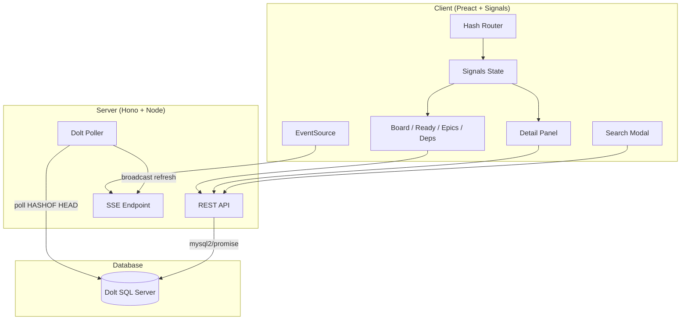

# bd-eye

A read-only visual dashboard for [Beads](https://github.com/steveyegge/beads) issue databases backed by [Dolt](https://www.dolthub.com/), watching for changes and pushing live updates to all connected browsers via Server-Sent Events.

## Features

- Kanban board with issues grouped by status
- Ready queue showing unblocked issues available for work
- Epic explorer with child-issue progress bars
- Dependency graph displaying blocking relationships
- Full-text search across titles, descriptions, and notes
- Live updates: the UI refreshes automatically when the database changes
- Filtering by priority, type, assignee, and label
- Deep-linkable views and issue selection via hash routing

## Prerequisites

- Node.js >= 18
- A running Dolt SQL server

## Quick Start

```sh
npm install
npm run build
npm start
```

During development, run the Vite dev server and the API server together:

```sh
npm run dev
```

This starts the API server on port 3333 and the Vite dev server on port 5174 with API requests proxied automatically.

## Environment Variables

| Variable        | Description                                      | Default                                            |
|-----------------|--------------------------------------------------|----------------------------------------------------|
| `PORT`          | HTTP port for the production server              | `3333`                                             |
| `DOLT_HOST`     | Dolt SQL server hostname                         | `127.0.0.1`                                        |
| `DOLT_PORT`     | Dolt SQL server port                             | `3306`                                             |
| `DOLT_USER`     | Dolt SQL server username                         | `root`                                             |
| `DOLT_PASSWORD`  | Dolt SQL server password                         | *(empty)*                                          |
| `DOLT_DATABASE` | Dolt database name                               | Auto-discovered if the server has exactly one user database |

### Dolt setup

Start a Dolt SQL server, then point bd-eye at it:

```sh
dolt sql-server --host 127.0.0.1 --port 3307 --data-dir .beads/dolt
```

```sh
DOLT_PORT=3307 npm start
```

If the server hosts exactly one user database, it is selected automatically. If there are multiple databases, set `DOLT_DATABASE` explicitly:

```sh
DOLT_PORT=3307 DOLT_DATABASE=beads_omnisearch npm start
```

Live updates work by polling `HASHOF('HEAD')` every 2 seconds — any Dolt commit triggers a refresh.

## Keyboard Shortcuts

| Key            | Action              |
|----------------|----------------------|
| `b`            | Switch to Board view |
| `r`            | Switch to Ready Queue |
| `e`            | Switch to Epics view |
| `d`            | Switch to Dependencies view |
| `Ctrl/Cmd + K` | Open search          |
| `Escape`       | Close detail panel   |

## Architecture



The server connects to a Dolt SQL server via mysql2. A poller checks `HASHOF('HEAD')` every 2 seconds. On any change, a `refresh` event is broadcast over SSE to all connected clients. The Preact client uses `@preact/signals` for reactive state and a hash-based router to drive four views, each fetching data from the API and re-fetching on SSE notifications.

## License

MIT
