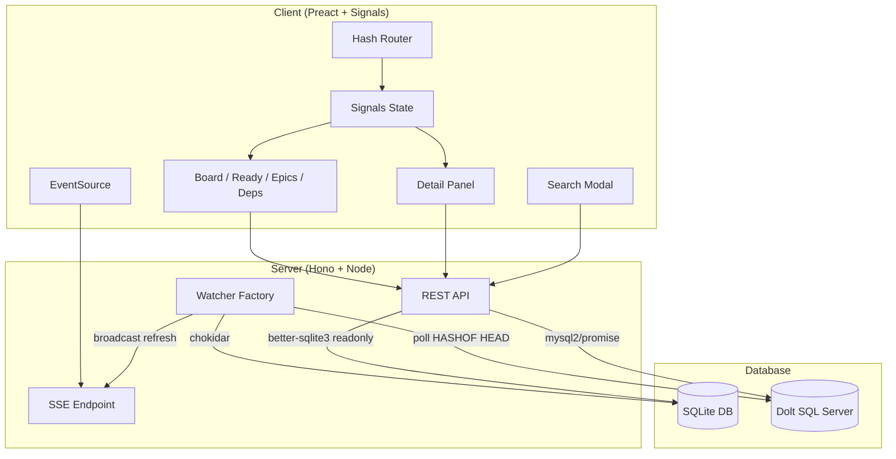

# bd-eye

A read-only visual dashboard for [Beads](https://github.com/steveyegge/beads) issue databases. It supports both SQLite and [Dolt](https://www.dolthub.com/) backends, watching for changes and pushing live updates to all connected browsers via Server-Sent Events.

## Features

- Kanban board with issues grouped by status
- Ready queue showing unblocked issues available for work
- Epic explorer with child-issue progress bars
- Dependency graph displaying blocking relationships
- Full-text search across titles, descriptions, and notes
- Live updates: the UI refreshes automatically when the database changes
- Filtering by priority, type, assignee, and label
- Deep-linkable views and issue selection via hash routing

## Prerequisites

- Node.js >= 18
- A Beads database — either a SQLite file (`.beads/*.db`) or a running Dolt SQL server

## Quick Start

```sh
npm install
npm run build
npm start
```

During development, run the Vite dev server and the API server together:

```sh
npm run dev
```

This starts the API server on port 3333 and the Vite dev server on port 5174 with API requests proxied automatically.

## Environment Variables

| Variable        | Description                                      | Default                                            |
|-----------------|--------------------------------------------------|----------------------------------------------------|
| `BEADS_DB`      | Path to the Beads database (`.db` file or Dolt repo directory) | Auto-discovered from `.beads/` up the directory tree, falling back to `~/.beads/default.db` |
| `PORT`          | HTTP port for the production server              | `3333`                                             |
| `DOLT_HOST`     | Dolt SQL server hostname                         | `127.0.0.1`                                        |
| `DOLT_PORT`     | Dolt SQL server port                             | `3306`                                             |
| `DOLT_USER`     | Dolt SQL server username                         | `root`                                             |
| `DOLT_PASSWORD`  | Dolt SQL server password                         | *(empty)*                                          |
| `DOLT_DATABASE` | Dolt database name                               | `beads`                                            |

### Database detection

When `BEADS_DB` points to a directory containing a `.dolt` subdirectory, bd-eye connects to a Dolt SQL server using the `DOLT_*` variables. Otherwise it opens the path as a SQLite file via better-sqlite3.

### Dolt setup

```sh
dolt sql-server -u root
```

Then point `BEADS_DB` at the Dolt repo directory:

```sh
BEADS_DB=/path/to/dolt-repo npm start
```

Live updates work by polling `HASHOF('HEAD')` every 2 seconds.

## Keyboard Shortcuts

| Key            | Action              |
|----------------|----------------------|
| `b`            | Switch to Board view |
| `r`            | Switch to Ready Queue |
| `e`            | Switch to Epics view |
| `d`            | Switch to Dependencies view |
| `Ctrl/Cmd + K` | Open search          |
| `Escape`       | Close detail panel   |

## Architecture



The server auto-detects the database type and opens it via the appropriate driver (better-sqlite3 for SQLite, mysql2 for Dolt). For SQLite, a chokidar file watcher monitors the database and its WAL/SHM files. For Dolt, a poller checks `HASHOF('HEAD')` every 2 seconds. On any change, a `refresh` event is broadcast over SSE to all connected clients. The Preact client uses `@preact/signals` for reactive state and a hash-based router to drive four views, each fetching data from the API and re-fetching on SSE notifications.

## License

MIT
