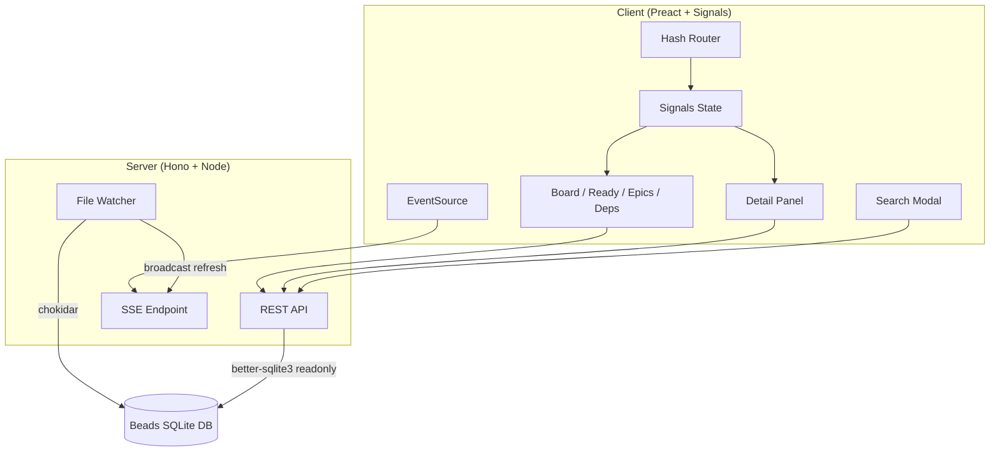

# bd-eye

A read-only visual dashboard for [Beads](https://github.com/steveyegge/beads) issue databases. It watches the underlying SQLite file for changes and pushes live updates to all connected browsers via Server-Sent Events.

## Features

- Kanban board with issues grouped by status
- Ready queue showing unblocked issues available for work
- Epic explorer with child-issue progress bars
- Dependency graph displaying blocking relationships
- Full-text search across titles, descriptions, and notes
- Live updates: the UI refreshes automatically when the database changes
- Filtering by priority, type, assignee, and label
- Deep-linkable views and issue selection via hash routing

## Prerequisites

- Node.js >= 18
- A Beads SQLite database (`.beads/*.db`)

## Quick Start

```sh
npm install
npm run build
npm start
```

During development, run the Vite dev server and the API server together:

```sh
npm run dev
```

This starts the API server on port 3333 and the Vite dev server on port 5174 with API requests proxied automatically.

## Environment Variables

| Variable   | Description                                      | Default                                            |
|------------|--------------------------------------------------|----------------------------------------------------|
| `BEADS_DB` | Absolute path to the Beads SQLite database file  | Auto-discovered from `.beads/` up the directory tree, falling back to `~/.beads/default.db` |
| `PORT`     | HTTP port for the production server              | `3333`                                             |

## Keyboard Shortcuts

| Key            | Action              |
|----------------|----------------------|
| `b`            | Switch to Board view |
| `r`            | Switch to Ready Queue |
| `e`            | Switch to Epics view |
| `d`            | Switch to Dependencies view |
| `Ctrl/Cmd + K` | Open search          |
| `Escape`       | Close detail panel   |

## Architecture



The server opens the Beads database in read-only WAL mode and exposes a REST API via Hono. A chokidar file watcher monitors the database and its WAL/SHM files; on any change it broadcasts a `refresh` event over SSE to all connected clients. The Preact client uses `@preact/signals` for reactive state and a hash-based router to drive four views, each fetching data from the API and re-fetching on SSE notifications.

## License

MIT
