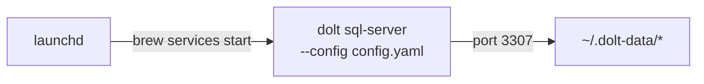
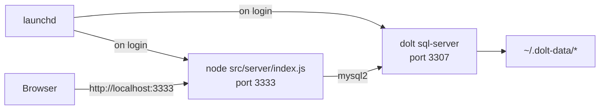
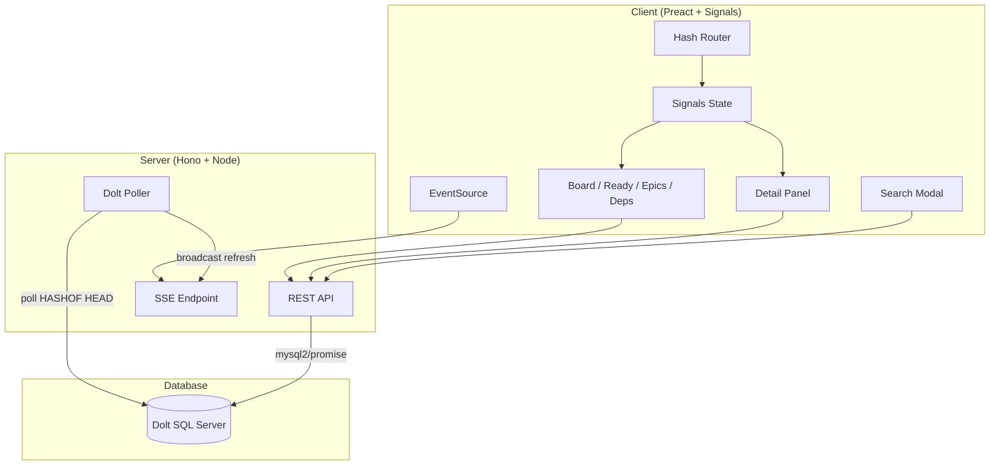

# bd-eye

A read-only visual dashboard for [Beads](https://github.com/steveyegge/beads) issue databases backed by [Dolt](https://www.dolthub.com/), watching for changes and pushing live updates to all connected browsers via Server-Sent Events.

## Features

- Kanban board with issues grouped by status
- Ready queue showing unblocked issues available for work
- Epic explorer with child-issue progress bars
- Dependency graph displaying blocking relationships
- Full-text search across titles, descriptions, and notes
- Live updates: the UI refreshes automatically when the database changes
- Filtering by priority, type, assignee, and label
- Deep-linkable views and issue selection via hash routing

## Prerequisites

- Node.js >= 18
- A running Dolt SQL server

## Quick Start

```sh
npm install
npm run build
npm start
```

During development, run the Vite dev server and the API server together:

```sh
npm run dev
```

This starts the API server on port 3333 and the Vite dev server on port 5174 with API requests proxied automatically.

## Environment Variables

| Variable        | Description                                      | Default                                            |
|-----------------|--------------------------------------------------|----------------------------------------------------|
| `PORT`          | HTTP port for the production server              | `3333`                                             |
| `DOLT_HOST`     | Dolt SQL server hostname                         | `127.0.0.1`                                        |
| `DOLT_PORT`     | Dolt SQL server port                             | `3306`                                             |
| `DOLT_USER`     | Dolt SQL server username                         | `root`                                             |
| `DOLT_PASSWORD`  | Dolt SQL server password                         | *(empty)*                                          |

### Dolt setup

Start a Dolt SQL server, then point bd-eye at it:

```sh
dolt sql-server --host 127.0.0.1 --port 3307 --data-dir ~/.dolt-data
```

```sh
DOLT_PORT=3307 npm start
```

bd-eye discovers all beads databases on the server automatically and lets you switch between them in the UI. Live updates work by polling `MAX(updated_at)` every 2 seconds — any change triggers a refresh.

### Running as macOS services

Both Dolt and bd-eye can run as background services via launchd, starting automatically on login.

#### Dolt service

Install dolt via Homebrew and configure `/opt/homebrew/etc/dolt/config.yaml`:

```yaml
log_level: info
listener:
  host: 127.0.0.1
  port: 3307
data_dir: /Users/<you>/.dolt-data
```

> **Note:** YAML does not expand `~` — use the absolute path to your home directory.

Then start the service:

```sh
brew services start dolt
```


```mermaid
flowchart LR
    launchd -->|"brew services start"| Dolt["dolt sql-server<br/>--config config.yaml"]
    Dolt -->|"port 3307"| Databases["~/.dolt-data/*"]
```

Verify it's running:

```sh
mysql -h 127.0.0.1 -P 3307 -u root -e "SHOW DATABASES"
```

Manage with:

```sh
brew services stop dolt     # stop
brew services restart dolt  # restart
```

#### bd-eye service

Create a launchd plist at `~/Library/LaunchAgents/com.<you>.bd-eye.plist`:

```xml
<?xml version="1.0" encoding="UTF-8"?>
<!DOCTYPE plist PUBLIC "-//Apple//DTD PLIST 1.0//EN"
  "http://www.apple.com/DTDs/PropertyList-1.0.dtd">
<plist version="1.0">
<dict>
    <key>Label</key>
    <string>com.<you>.bd-eye</string>
    <key>ProgramArguments</key>
    <array>
        <string>/path/to/node</string>
        <string>src/server/index.js</string>
    </array>
    <key>WorkingDirectory</key>
    <string>/path/to/bd-eye</string>
    <key>EnvironmentVariables</key>
    <dict>
        <key>DOLT_PORT</key>
        <string>3307</string>
    </dict>
    <key>KeepAlive</key>
    <true/>
    <key>RunAtLoad</key>
    <true/>
    <key>StandardOutPath</key>
    <string>/Users/<you>/Library/Logs/bd-eye.log</string>
    <key>StandardErrorPath</key>
    <string>/Users/<you>/Library/Logs/bd-eye.error.log</string>
</dict>
</plist>
```

> **Note:** launchd does not source your shell profile, so version manager shims (asdf, nvm, fnm) won't resolve. Use the absolute path to the node binary, e.g. `~/.asdf/installs/nodejs/24.8.0/bin/node`. Find yours with `asdf which node` or `which node`.

Build the frontend assets, then load the service:

```sh
npm run build
launchctl load ~/Library/LaunchAgents/com.<you>.bd-eye.plist
```

Manage with:

```sh
# stop
launchctl unload ~/Library/LaunchAgents/com.<you>.bd-eye.plist

# restart (after code changes + npm run build)
launchctl kickstart -k gui/$(id -u)/com.<you>.bd-eye

# logs
tail -f ~/Library/Logs/bd-eye.log
```


```mermaid
flowchart LR
    launchd -->|"on login"| Dolt["dolt sql-server<br/>port 3307"]
    launchd -->|"on login"| BdEye["node src/server/index.js<br/>port 3333"]
    BdEye -->|"mysql2"| Dolt
    Dolt --> Data["~/.dolt-data/*"]
    Browser -->|"http://localhost:3333"| BdEye
```

### Adding projects

To add a new beads project to the shared Dolt server:

```sh
cd ~/projects/new-project
bd init --server-port 3307
```

Restart the Dolt server to pick up the new database. bd-eye discovers all valid beads databases automatically via `SHOW DATABASES`.

## Keyboard Shortcuts

| Key            | Action              |
|----------------|----------------------|
| `b`            | Switch to Board view |
| `r`            | Switch to Ready Queue |
| `e`            | Switch to Epics view |
| `d`            | Switch to Dependencies view |
| `Ctrl/Cmd + K` | Open search          |
| `Escape`       | Close detail panel   |

## Architecture


```mermaid
graph TD
    subgraph Client ["Client (Preact + Signals)"]
        Router[Hash Router]
        State[Signals State]
        Views[Board / Ready / Epics / Deps]
        Detail[Detail Panel]
        Search[Search Modal]
        SSE[EventSource]
    end

    subgraph Server ["Server (Hono + Node)"]
        API[REST API]
        Stream[SSE Endpoint]
        Watcher[Dolt Poller]
    end

    subgraph Database
        Dolt[(Dolt SQL Server)]
    end

    Router --> State
    State --> Views
    State --> Detail
    Views --> API
    Detail --> API
    Search --> API
    SSE --> Stream
    Watcher -->|poll HASHOF HEAD| Dolt
    Watcher -->|broadcast refresh| Stream
    API -->|mysql2/promise| Dolt
```

The server connects to a Dolt SQL server via mysql2. A poller checks `HASHOF('HEAD')` every 2 seconds. On any change, a `refresh` event is broadcast over SSE to all connected clients. The Preact client uses `@preact/signals` for reactive state and a hash-based router to drive four views, each fetching data from the API and re-fetching on SSE notifications.

## License

MIT
