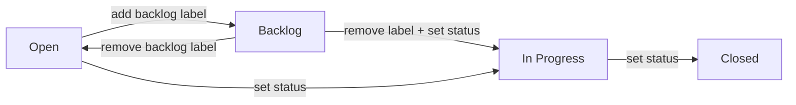

# Backlog Column Design

## Problem

The Open column accumulates tickets that aren't candidates for immediate work, making it hard to see what's actually available to pick up. We need a way to park tickets that aren't ready yet.

## Design

Add a Backlog column to the Kanban board. A ticket appears in Backlog when it has a `backlog` label (parked indefinitely) or a future `defer_until` date (time-boxed deferral). Both can coexist on the same ticket.

Tickets with an expired `defer_until` stay in Backlog but get a visual nudge (amber border + tooltip) so the user notices and can promote them manually.

## Column Routing

```
Backlog:     status=open AND (has 'backlog' label OR defer_until > now)
Open:        status=open AND NOT backlog
In Progress: status=in_progress
Closed:      status=closed
```

Graduated defers (defer_until <= now) remain in Backlog with visual indicator.

## Drag Interactions



- **To Backlog**: POST `/issues/:id/labels` with `{ label: "backlog" }`
- **From Backlog to Open**: DELETE `/issues/:id/labels/backlog`
- **From Backlog to In Progress**: DELETE label + PATCH status (two calls)
- **All other drags**: existing status PATCH

## New API Endpoints

### POST /issues/:id/labels
Request: `{ "label": "string" }`
Response: `{ "ok": true }`
Inserts into the `labels` table. Idempotent (no error if label already exists).

### DELETE /issues/:id/labels/:label
Response: `{ "ok": true }`
Deletes from the `labels` table. Idempotent (no error if label doesn't exist).

## Db Interface Changes

Two new methods on the `Db` typedef:
- `addLabel(issueId: string, label: string) => Promise<void>`
- `removeLabel(issueId: string, label: string) => Promise<void>`

## Frontend Changes

### Board.jsx
- Add `{ key: 'backlog', label: 'Backlog' }` as first entry in `COLUMNS`
- Replace simple `effectiveStatus === col.key` filter with routing function that checks labels and defer_until for the backlog/open split
- Branch drag handler: label operations for backlog transitions, status PATCH for others

### Card visual nudge
- Amber/orange left border on cards with expired `defer_until`
- Tooltip: "Deferred until {date} — expired"
- CSS only + date comparison in render, no new state

## Not In Scope

- No beads CLI changes (already supports `--defer` and `--add-label`)
- No new status values in beads
- No SSE/watcher changes
- No FilterBar changes
